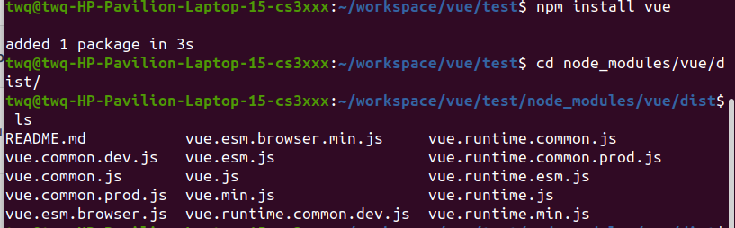
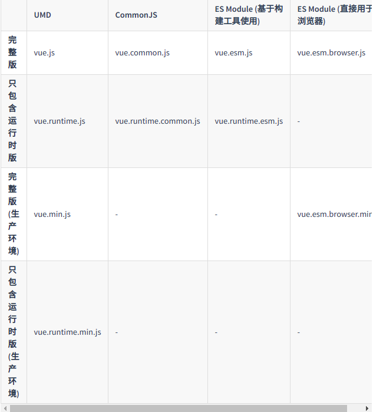

## 浏览器Vue Devtools

可以审查调试Vue应用
<https://github.com/vuejs/vue-devtools#vue-devtools>


## <script>引入

开发版本<https://cn.vuejs.org/js/vue.js>
生产版本<https://cn.vuejs.org/js/vue.min.js>


## CDN引入

全称Content Delivery Network，内容分发网络。主要是内容存储和分发技术

```js
<script src="https://cdn.jsdelivr.net/npm/vue/dist/vue.js"></script>
```


## NPM

```
npm install vue
```

## 命令行工具CLI

是用于快速开发Vue.js的完整系统

```js
npm install -g @vue/cli

npm uninstall -g @vue/cli//卸载

npm update -g @vue/cli//更新
```

### dist下是vue.js不同的构建版本



### 解释：  




## 术语

**完整版:**  包含编译器和运行时版本

**编译器:** 用来将模板字符串编译成JavaScript渲染函数的代码

**运行时：** 用来创建Vue实例、渲染并处理虚拟DOM等的代码。

**UMD:** UMD版本可以通过<script>标签直接用在浏览器中。

**CommonJS:** CommonJS版本用来配合老的打包工具。

**ES Module:** 从2.6开始Vue会提供两个ES Modules(ESM)构建文件：

**为打包工具提供的 ESM：** 为诸如 webpack 2 或 Rollup 提供的现代打包工具。ESM 格式被设计为可以被静态分析，所以打包工具可以利用这一点来进行“tree-shaking”并将用不到的代码排除出最终的包。为这些打包工具提供的默认文件 (pkg.module) 是只有运行时的 ES Module 构建 (vue.runtime.esm.js)。

**为浏览器提供的 ESM (2.6+)：** 用于在现代浏览器中通过 <script type="module"> 直接导入。


## 运行时+编译器vs.只包含运行时
```js
// 需要编译器
new Vue({
  template: '<div>{{ hi }}</div>'//需要解析模板转换为下方代码
})

// 不需要编译器
new Vue({
  render (h) {
    return h('div', this.hi)
  }
})
```
使用vue-loader或vueify的时候，*.vue文件内部模板会在模板构建时预编译成JavaScript。不需要编译器，只用运行时版本即可。

因为运行时版本相比完整版体积要小大约 30%，所以应该尽可能使用这个版本。如果你仍然希望使用完整版，则需要在打包工具里配置一个别名：
**webpack**
```js
module.exports = {
  // ...
  resolve: {
    alias: {
      'vue$': 'vue/dist/vue.esm.js' // 用 webpack 1 时需用 'vue/dist/vue.common.js'
    }
  }
}
```

## 开发环境vs.生产环境模式

对于 UMD 版本来说，开发环境/生产环境模式是硬编码好的：开发环境下用未压缩的代码，生产环境下使用压缩后的代码。

CommonJS 和 ES Module 版本是用于打包工具的，因此我们不提供压缩后的版本。你需要自行将最终的包进行压缩。

CommonJS 和 ES Module 版本同时保留原始的 process.env.NODE_ENV 检测，以决定它们应该运行在什么模式下。你应该使用适当的打包工具配置来替换这些环境变量以便控制 Vue 所运行的模式。把 process.env.NODE_ENV 替换为字符串字面量同时可以让 UglifyJS 之类的压缩工具完全丢掉仅供开发环境的代码块，以减少最终的文件尺寸。

**webpack**
```js
module.exports = {
  mode: 'production'
}

```
## CSP环境

有些环境，如 Google Chrome Apps，会强制应用内容安全策略 (CSP)，不能使用 new Function() 对表达式求值。这时可以用 CSP 兼容版本。完整版本依赖于该功能来编译模板，所以无法在这些环境下使用。

另一方面，运行时版本则是完全兼容 CSP 的。当通过 webpack + vue-loader 或者 Browserify + vueify 构建时，模板将被预编译为 render 函数，可以在 CSP 环境中完美运行。


